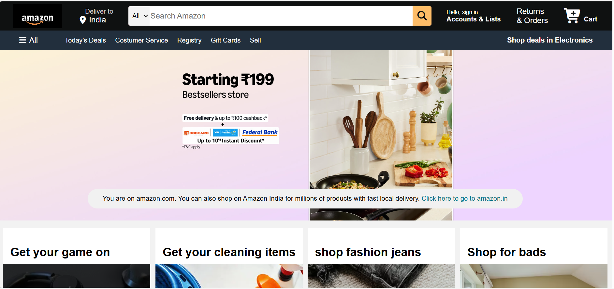
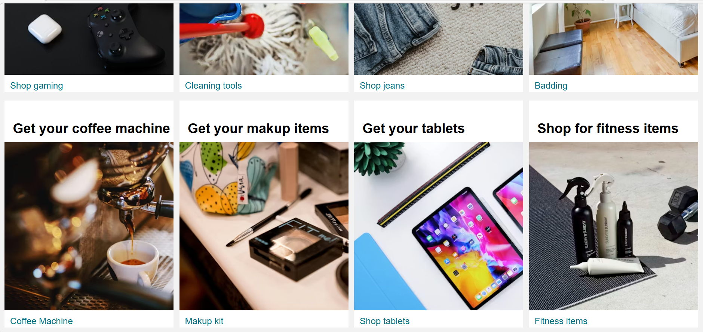
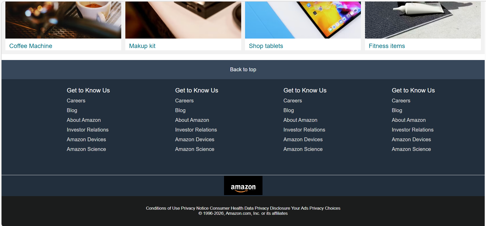

# 🛒 Amazon UI Clone

## 📌 Project Description
This project is a frontend clone of the Amazon website built using HTML and CSS.It replicates the layout and design of a modern e-commerce platform, focusing on user interface.

---

## 🚀 Features
- 🧭 Navigation Bar with logo, search bar, and cart
- 📦 Product Grid Layout
- 🎯 Hero Section with banner
- 🛍️ Multiple product categories
- 📱 Responsive Design (basic)
- 🔝 Footer with useful links

---

## 🛠️ Technologies Used
- HTML5
- CSS3
- Font Awesome

---

## 📸 Screenshots

